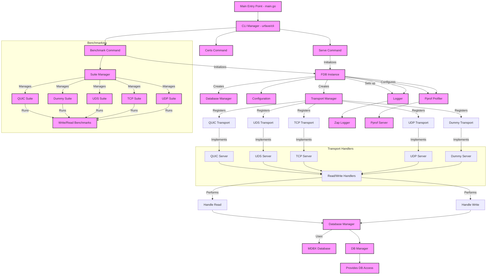

[](https://github.com/unpackdev/fdb/actions/workflows/test.yml)
[](https://github.com/unpackdev/fdb/actions/workflows/build.yml)
[](https://github.com/unpackdev/fdb/actions/workflows/gosec.yml)
[](https://coveralls.io/github/unpackdev/fdb?branch=main)
[](https://goreportcard.com/report/github.com/unpackdev/fdb)
[](https://opensource.org/licenses/MIT)
[](https://pkg.go.dev/github.com/unpackdev/fdb)
[](https://discord.gg/PdHVbuTQRX)


# (f)db

**NOTE: At this moment I am adding all possible faster ways, including TCP, to be able to do proper benchmarking first.
In the future, I may drop transports that prove to be inefficient based on benchmark results. At the same time I will slowly start to write wrappers around the packages for convenient usage incl. deployments.**

This is currently a prototype, with the idea of building incredibly fast transport layers on 
top of key-value (KV) databases. The goal is to allow one or multiple instances of these 
databases to be started and cross-shared in user space or accessed remotely bypassing general locks
that are enforced in KV databases or some of the OLAP databases such as DuckDB.

This project is going to be either f**k databases or fast database... There is no third solution...

Though this will be hard to achieve without DPDK. Will not overkill the prototype with it for now...

## Diagrams




### Explanation of the Diagram:

1. **Main Entry Point**: This is where the `main.go` resides. The CLI manager (`urfave/cli`) manages various commands.
2. **Test Command**: This command benchmarks the real client. It includes operations such as client actions and collects metrics like memory usage and execution time.
3. **gRPC/QUIC/UDP/UDS Servers**: These are different servers supported by `fdb`, each with its own handler registry for processing requests.
4. **Handlers**: Each server has a `WriteHandler` and `ReadHandler` that interact with the `MDBX` database to set and get key-value pairs.
5. **Connection Handling**: This is where the incoming connections are processed. It uses `gnet` and `QUIC` to handle streams or frames and react to incoming data.


## GNET

gnet is a high-performance, lightweight, non-blocking, event-driven networking framework written in pure Go.

gnet is an event-driven networking framework that is ultra-fast and lightweight. It is built from scratch by exploiting epoll and kqueue and it can achieve much higher performance with lower memory consumption than Go net in many specific scenarios.

https://github.com/panjf2000/gnet


## QUIC (HTTP/3)

https://github.com/quic-go/quic-go/wiki/UDP-Buffer-Sizes


```
sysctl -w net.core.rmem_max=7500000
sysctl -w net.core.wmem_max=7500000
```

## TODO

- Due to changes in the entire logic now unit tests are broken. 

## IDEAS

- P2P Sync... (Supervisors vs. Readers a.k.a. validators vs clients)
- Could be grpc sync as well... Need to see complexity vs. benefits...

## Commands

### Certificates and co.

```
make build && ./build/fdb certs --cert=./data/certs/cert.pem --key=./data/certs/key.pem
```

### Benchmark

```
make build && ./build/fdb benchmark --suite quic --clients 5 --messages 1000 --type write
```

## Benchmarks

There is a dummy transport, starts the (gnet) UDP and does pretty much nothing. We're going to 
use that one as a baseline for any other benchmark.

### DUMMY

#### Write Benchmark

```
make build && ./build/fdb benchmark --suite dummy --clients 50 --messages 1000000 --type write --timeout 120

--- Benchmark Report ---
Total Clients: 50
Messages per Client: 1000000
Total Messages: 50000000
Success Messages: 50000000
Failed Messages: 0
Total Duration: 13.604984597s
Average Latency: 10.925µs
P50 Latency: 5.87µs
P90 Latency: 7.4µs
P99 Latency: 14.56µs
Throughput: 3,675,123 messages/second
Memory Used: 6.05 MB
Latency Jitter (StdDev): 346.418350µs

```

### TCP

#### Write Benchmark

```
make build && ./build/fdb benchmark --suite tcp --clients 50 --messages 200000 --type write --timeout 120

--- Benchmark Report ---
Total Clients: 50
Messages per Client: 200000
Total Messages: 10000000
Success Messages: 10000000
Failed Messages: 0
Total Duration: 17.935868899s
Average Latency: 83.1µs
P50 Latency: 64.572µs
P90 Latency: 122.153µs
P99 Latency: 304.218µs
Throughput: 557,541 messages/second
Memory Used: 667.91 MB
Latency Jitter (StdDev): 148.417551µs
```

### QUIC

#### Write Benchmark

```
make build && ./build/fdb benchmark --suite quic --clients 50 --messages 100000 --type write --timeout 120

--- Benchmark Report ---
Total Clients: 50
Messages per Client: 100000
Total Messages: 5000000
Success Messages: 5000000
Failed Messages: 0
Total Duration: 54.655111416s
Average Latency: 543.478µs
P50 Latency: 521.064µs
P90 Latency: 945.644µs
P99 Latency: 1.603621ms
Throughput: 91,482 messages/second
Memory Used: 17260.96 MB
Latency Jitter (StdDev): 319.379812µs
```

### UDP

#### Write Benchmark

```
make build && ./build/fdb benchmark --suite udp --clients 50 --messages 100000 --type write --timeout 120

--- Benchmark Report ---
Total Clients: 50
Messages per Client: 100000
Total Messages: 5000000
Success Messages: 5000000
Failed Messages: 0
Total Duration: 16.771189289s
Average Latency: 169.167µs
P50 Latency: 128.563µs
P90 Latency: 307.689µs
P99 Latency: 877.784µs
Throughput: 298,130 messages/second
Memory Used: 678.49 MB
Latency Jitter (StdDev): 173.144187µs
```

## For Developers

- Main entrypoint to the application can be found at [entrypoint](./entrypoint)

## Unit Tests

```
go test -v -cover
=== RUN   TestManagerDbOperations
=== RUN   TestManagerDbOperations/Set_and_Get_Key
=== RUN   TestManagerDbOperations/Check_Exists_Key
=== RUN   TestManagerDbOperations/Delete_Key
--- PASS: TestManagerDbOperations (0.02s)
    --- PASS: TestManagerDbOperations/Set_and_Get_Key (0.01s)
    --- PASS: TestManagerDbOperations/Check_Exists_Key (0.01s)
    --- PASS: TestManagerDbOperations/Delete_Key (0.01s)
=== RUN   TestUDPServer
2024/09/14 15:44:07 Awaiting for started closure...
2024/09/14 15:44:07 UDP Server started on udp://127.0.0.1:8781
2024/09/14 15:44:07 UDP Server is listening on 127.0.0.1:8781
2024/09/14 15:44:07 Closed started...
2024/09/14 15:44:07 Started closure detected...
=== RUN   TestUDPServer/Valid_Write_and_Read
    udp_server_test.go:172: Response from server after write: Message written to database
    udp_server_test.go:214: Response from server after read: test value
=== RUN   TestUDPServer/Invalid_Key_Length_(Too_Short)
2024/09/14 15:44:08 Invalid message length: 32, expected at least 34 bytes
    udp_server_test.go:172: Response from server after write: Invalid message format
    udp_server_test.go:179: Received expected error response: Invalid message format
=== RUN   TestUDPServer/Invalid_Handler_Type
    udp_server_test.go:172: Response from server after write: ERROR: Invalid action
    udp_server_test.go:179: Received expected error response: ERROR: Invalid action
=== RUN   TestUDPServer/Empty_Data
2024/09/14 15:44:08 Invalid message length: 33, expected at least 34 bytes
    udp_server_test.go:172: Response from server after write: Invalid message format
    udp_server_test.go:179: Received expected error response: Invalid message format
--- PASS: TestUDPServer (0.10s)
    --- PASS: TestUDPServer/Valid_Write_and_Read (0.09s)
    --- PASS: TestUDPServer/Invalid_Key_Length_(Too_Short) (0.00s)
    --- PASS: TestUDPServer/Invalid_Handler_Type (0.00s)
    --- PASS: TestUDPServer/Empty_Data (0.00s)
PASS
coverage: 66.3% of statements
ok  	github.com/unpackdev/fdb	0.132s
```


## Benchmarks

```
go test -run=^$ -bench=BenchmarkUDPServerWrite -v
goos: linux
goarch: amd64
pkg: github.com/unpackdev/fdb
cpu: AMD Ryzen Threadripper 3960X 24-Core Processor 
BenchmarkUDPServerWrite
BenchmarkUDPServerWrite-48    	  279058	      4473 ns/op
PASS
ok  	github.com/unpackdev/fdb	2.879s
```