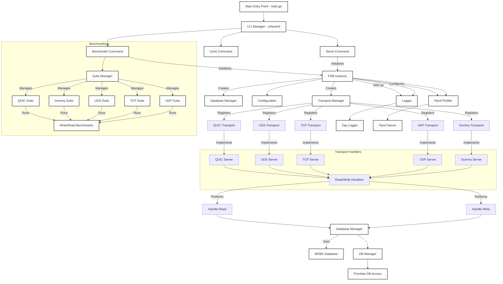

[](https://github.com/unpackdev/fdb/actions/workflows/test.yml)
[](https://github.com/unpackdev/fdb/actions/workflows/build.yml)
[](https://github.com/unpackdev/fdb/actions/workflows/gosec.yml)
[](https://coveralls.io/github/unpackdev/fdb?branch=main)
[](https://goreportcard.com/report/github.com/unpackdev/fdb)
[](https://opensource.org/licenses/MIT)
[](https://pkg.go.dev/github.com/unpackdev/fdb)
[](https://discord.gg/PdHVbuTQRX)


# (f)db

**NOTE: At this moment I am adding all possible faster ways, including TCP, to be able to do proper benchmarking first.
In the future, I may drop transports that prove to be inefficient based on benchmark results. At the same time I will slowly start to write wrappers around the packages for convenient usage incl. deployments.**

**UNDER ACTIVE DEVELOPMENT**

This is currently a prototype, with the idea of building incredibly fast transport layers on 
top of key-value (KV) databases. The goal is to allow one or multiple instances of these 
databases to be started and cross-shared in user space or accessed remotely bypassing general locks
that are enforced in KV databases or some of the OLAP databases such as DuckDB.

This project is going to be either f**k databases or fast database... There is no third solution...

Though this will be hard to achieve without DPDK. Will not overkill the prototype with it for now...

## Diagram




### Explanation of the Diagram:

1. **Main Entry Point**: This is the main starting point of the application, located in `main.go`. It utilizes the `urfave/cli` package to manage multiple CLI commands, such as `certs`, `benchmark`, and `serve`. Each command has specific functionality related to certificate management, benchmarking, or starting the server.

2. **FDB Initialization**: Both the `benchmark` and `serve` commands initialize an `FDB Instance`. This instance manages core components such as the transport manager, database manager, logger, and performance profiler (`pprof`).

3. **Transport Manager**: The transport manager handles the registration of various transport types. These transports include `QUIC`, `UDS`, `TCP`, `UDP`, and `Dummy` transport types, each having its own corresponding server implementation.

4. **Transports and Servers**: Each registered transport is associated with a specific server. For example, `QUIC` uses a `QUIC Server`, `UDS` uses a `UDS Server`, and so on. Each server has a set of read and write handlers for processing incoming and outgoing messages.

5. **Handlers and Operations**: The read and write handlers are responsible for processing messages. They handle both reading from and writing to the underlying transport and interact with the database manager to store and retrieve data.

6. **Database Manager**: The database manager interacts with the `MDBX` database, providing access to key-value storage. Both read and write handlers utilize the database manager to perform database operations.

7. **Benchmarking Suite**: The `benchmark` command initializes a `Suite Manager` which manages multiple benchmarking suites for each transport type, such as `QUIC Suite`, `Dummy Suite`, `UDS Suite`, `TCP Suite`, and `UDP Suite`. Each suite runs a set of benchmarks that measure the read/write performance of the corresponding transport.

8. **Configuration and Logger**: The FDB instance loads configuration details and initializes a `Zap Logger` for structured logging. Configuration files are used to manage settings for transports, database, and other components.

9. **Pprof Profiler**: The `pprof` profiler is used to monitor the performance of the application. It is set up within the FDB instance and exposes a profiling server for detailed analysis of memory and CPU usage during runtime.

10. **Database Interaction**: During both read and write operations, the database manager interacts with the underlying `MDBX` database to store and retrieve data, ensuring efficient key-value storage management.

11. **CLI Commands**:
- **Certs Command**: Manages certificate generation and handling.
- **Benchmark Command**: Runs benchmarking tests for each transport, collecting performance metrics like throughput and latency.
- **Serve Command**: Starts the FDB server with all configured transports.

12. **Legend**: The diagram outlines the key components and their relationships, showing how the transport manager interacts with the servers, handlers, and database, along with the benchmarking and profiling systems.


## Usage

### As a Library

To include `fdb` in your project, use the following command to install the package:

```bash
go get github.com/unpackdev/fdb
```

Make sure to review the documentation for proper integration and usage within your Go application.

### Docker

To run the fdb instance in a production-like environment, along with supporting services like OpenTelemetry and Jaeger for tracing and monitoring, follow these steps:
- Ensure you have Docker and Docker Compose installed.
- Clone the repository and start the services using Docker Compose.

```bash
git clone https://github.com/unpackdev/fdb
cd fdb
docker-compose up -d
```

This will bring up the [(f)db](https://github.com/unpackdev/fdb) instance, [OpenTelemetry](https://opentelemetry.io/docs/languages/go/) collector, and [Jaeger](https://www.jaegertracing.io/) for tracing, making the system ready for production-level monitoring and telemetry.


### Running the Binary

For a more custom or direct deployment, you can build and run the fdb binary manually.

- 1: Clone the repository

```bash
git clone https://github.com/unpackdev/fdb
cd fdb
```

- 2: Modify the config.yaml file as per your environment's requirements.
- 3: Build and start the server

```bash
make build
./build/fdb serve
```

Ensure that your configuration file is tuned for production, including settings for transports, database paths, logging levels, and performance profiling.
By default, this will start the server with all the transports and services configured in the config.yaml, ready for high-performance and production use.

## GNET

gnet is a high-performance, lightweight, non-blocking, event-driven networking framework written in pure Go.

gnet is an event-driven networking framework that is ultra-fast and lightweight. It is built from scratch by exploiting epoll and kqueue and it can achieve much higher performance with lower memory consumption than Go net in many specific scenarios.

https://github.com/panjf2000/gnet


## QUIC (HTTP/3)

https://github.com/quic-go/quic-go/wiki/UDP-Buffer-Sizes


```
sysctl -w net.core.rmem_max=7500000
sysctl -w net.core.wmem_max=7500000
```

## TODO

- Due to changes in the entire logic now unit tests are broken. 

## IDEAS

- P2P Sync... (Supervisors vs. Readers a.k.a. validators vs clients)
- Could be grpc sync as well... Need to see complexity vs. benefits...

## Commands

### Certificates and co.

```
make build && ./build/fdb certs --cert=./data/certs/cert.pem --key=./data/certs/key.pem
```

### Benchmark

```
make build && ./build/fdb benchmark --suite quic --clients 5 --messages 1000 --type write
```

## Benchmarks

There is a dummy transport, starts the (gnet) UDP and does pretty much nothing. We're going to 
use that one as a baseline for any other benchmark.

### DUMMY

#### Write Benchmark

```
make build && ./build/fdb benchmark --suite dummy --clients 50 --messages 1000000 --type write --timeout 120

--- Benchmark Report ---
Total Clients: 50
Messages per Client: 1000000
Total Messages: 50000000
Success Messages: 50000000
Failed Messages: 0
Total Duration: 13.604984597s
Average Latency: 10.925µs
P50 Latency: 5.87µs
P90 Latency: 7.4µs
P99 Latency: 14.56µs
Throughput: 3,675,123 messages/second
Memory Used: 6.05 MB
Latency Jitter (StdDev): 346.418350µs

```

### TCP

#### Write Benchmark

```
make build && ./build/fdb benchmark --suite tcp --clients 50 --messages 200000 --type write --timeout 120

--- Benchmark Report ---
Total Clients: 50
Messages per Client: 200000
Total Messages: 10000000
Success Messages: 10000000
Failed Messages: 0
Total Duration: 17.935868899s
Average Latency: 83.1µs
P50 Latency: 64.572µs
P90 Latency: 122.153µs
P99 Latency: 304.218µs
Throughput: 557,541 messages/second
Memory Used: 667.91 MB
Latency Jitter (StdDev): 148.417551µs
```

### QUIC

#### Write Benchmark

```
make build && ./build/fdb benchmark --suite quic --clients 50 --messages 100000 --type write --timeout 120

--- Benchmark Report ---
Total Clients: 50
Messages per Client: 100000
Total Messages: 5000000
Success Messages: 5000000
Failed Messages: 0
Total Duration: 54.655111416s
Average Latency: 543.478µs
P50 Latency: 521.064µs
P90 Latency: 945.644µs
P99 Latency: 1.603621ms
Throughput: 91,482 messages/second
Memory Used: 17260.96 MB
Latency Jitter (StdDev): 319.379812µs
```

### UDP

#### Write Benchmark

```
make build && ./build/fdb benchmark --suite udp --clients 50 --messages 100000 --type write --timeout 120

--- Benchmark Report ---
Total Clients: 50
Messages per Client: 100000
Total Messages: 5000000
Success Messages: 5000000
Failed Messages: 0
Total Duration: 16.771189289s
Average Latency: 169.167µs
P50 Latency: 128.563µs
P90 Latency: 307.689µs
P99 Latency: 877.784µs
Throughput: 298,130 messages/second
Memory Used: 678.49 MB
Latency Jitter (StdDev): 173.144187µs
```

## For Developers

- Main entrypoint to the application can be found at [entrypoint](./entrypoint)

## Unit Tests

```
go test -v -cover
=== RUN   TestManagerDbOperations
=== RUN   TestManagerDbOperations/Set_and_Get_Key
=== RUN   TestManagerDbOperations/Check_Exists_Key
=== RUN   TestManagerDbOperations/Delete_Key
--- PASS: TestManagerDbOperations (0.02s)
    --- PASS: TestManagerDbOperations/Set_and_Get_Key (0.01s)
    --- PASS: TestManagerDbOperations/Check_Exists_Key (0.01s)
    --- PASS: TestManagerDbOperations/Delete_Key (0.01s)
=== RUN   TestUDPServer
2024/09/14 15:44:07 Awaiting for started closure...
2024/09/14 15:44:07 UDP Server started on udp://127.0.0.1:8781
2024/09/14 15:44:07 UDP Server is listening on 127.0.0.1:8781
2024/09/14 15:44:07 Closed started...
2024/09/14 15:44:07 Started closure detected...
=== RUN   TestUDPServer/Valid_Write_and_Read
    udp_server_test.go:172: Response from server after write: Message written to database
    udp_server_test.go:214: Response from server after read: test value
=== RUN   TestUDPServer/Invalid_Key_Length_(Too_Short)
2024/09/14 15:44:08 Invalid message length: 32, expected at least 34 bytes
    udp_server_test.go:172: Response from server after write: Invalid message format
    udp_server_test.go:179: Received expected error response: Invalid message format
=== RUN   TestUDPServer/Invalid_Handler_Type
    udp_server_test.go:172: Response from server after write: ERROR: Invalid action
    udp_server_test.go:179: Received expected error response: ERROR: Invalid action
=== RUN   TestUDPServer/Empty_Data
2024/09/14 15:44:08 Invalid message length: 33, expected at least 34 bytes
    udp_server_test.go:172: Response from server after write: Invalid message format
    udp_server_test.go:179: Received expected error response: Invalid message format
--- PASS: TestUDPServer (0.10s)
    --- PASS: TestUDPServer/Valid_Write_and_Read (0.09s)
    --- PASS: TestUDPServer/Invalid_Key_Length_(Too_Short) (0.00s)
    --- PASS: TestUDPServer/Invalid_Handler_Type (0.00s)
    --- PASS: TestUDPServer/Empty_Data (0.00s)
PASS
coverage: 66.3% of statements
ok  	github.com/unpackdev/fdb	0.132s
```


## Benchmarks

```
go test -run=^$ -bench=BenchmarkUDPServerWrite -v
goos: linux
goarch: amd64
pkg: github.com/unpackdev/fdb
cpu: AMD Ryzen Threadripper 3960X 24-Core Processor 
BenchmarkUDPServerWrite
BenchmarkUDPServerWrite-48    	  279058	      4473 ns/op
PASS
ok  	github.com/unpackdev/fdb	2.879s
```