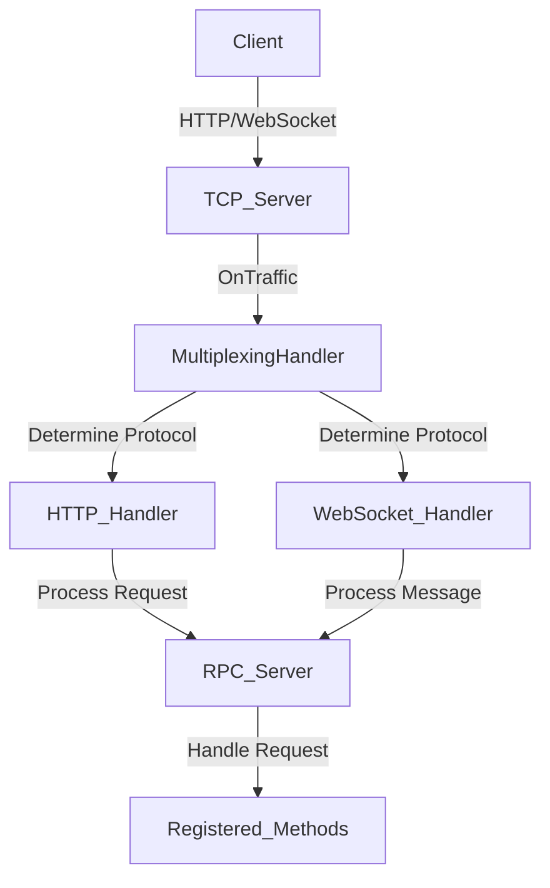

# RPC Package

The `rpc` package implements a JSON-RPC server that supports both HTTP and WebSocket protocols. It provides an efficient way to handle RPC requests, including subscription mechanisms for real-time notifications.

## Architecture Overview



- Client: Makes RPC requests over HTTP or WebSocket.
- TCP_Server: Listens for incoming TCP connections.
- MultiplexingHandler: Determines if the connection is HTTP or WebSocket and forwards it accordingly.
- HTTP_Handler: Handles HTTP requests, supports keep-alive connections.
- WebSocket_Handler: Handles WebSocket messages and maintains client connections.
- RPC_Server: Manages registered methods and dispatches requests.
- Registered_Methods: User-defined methods registered with the RPC server.

### Features

- Supports JSON-RPC over HTTP and WebSocket.
- Efficient buffer and connection management.
- HTTP keep-alive support for improved performance.
- Subscription mechanism over WebSocket for real-time notifications.
- Reusable buffer pools to reduce memory allocations.
- Asynchronous writes in WebSocket handler to improve performance.

## Getting Started

### 1.) Register RPC Methods:

```go
rpcServer := rpc.NewServer(logger, observability)
rpcServer.RegisterMethod("echo", EchoHandler)
```

### 2.) Start the RPC Server:

```go
if err := rpcServer.Start(context.Background()); err != nil {
    log.Fatal("Failed to start RPC server:", err)
}
```

### 3.) Implement Handlers:

```go
func EchoHandler(ctx context.Context, params json.RawMessage) (interface{}, *rpc.Error) {
    var message struct {
        Message string `json:"message"`
    }
    if err := json.Unmarshal(params, &message); err != nil {
        return nil, &rpc.Error{
            Code:    rpc.InvalidParams,
            Message: "Invalid parameters",
        }
    }
    return message.Message, nil
}
```

## Benchmark Results

The following are the benchmark results obtained from running the benchmarks:

### System Specifications

- **OS:** Linux (amd64)
- **CPU:** AMD Ryzen Threadripper 3960X 24-Core Processor

### Benchmark Results Overview

#### BenchmarkRPCOverHTTP

**Description:** Measures the performance of the RPC server handling requests over HTTP in a single-threaded manner.

**Results:**

- **Iterations:** 5,467
- **Time per Operation:** 190,065 ns/op (approximately 190 microseconds)
- **Memory Usage:**
    - **Bytes per Operation:** 10,081 B/op
    - **Allocations per Operation:** 119 allocs/op

**Throughput:**

- **Operations per Second:** ~5,262 ops/sec

#### BenchmarkRPCOverWebSocket

**Description:** Measures the performance of the RPC server handling requests over WebSocket in a single-threaded manner.

**Results:**

- **Iterations:** 10,513
- **Time per Operation:** 95,381 ns/op (approximately 95 microseconds)
- **Memory Usage:**
    - **Bytes per Operation:** 1,820 B/op
    - **Allocations per Operation:** 32 allocs/op

**Throughput:**

- **Operations per Second:** ~10,489 ops/sec

#### BenchmarkRPCOverHTTPParallel

**Description:** Simulates concurrent clients making RPC requests over HTTP.

**Results:**

    Iterations: 71,864
    Time per Operation: 14,393 ns/op (approximately 14 microseconds)
    Memory Usage:
        Bytes per Operation: 9,521 B/op
        Allocations per Operation: 117 allocs/op

**Throughput:**

    Operations per Second: ~69,486 ops/sec

#### BenchmarkRPCOverWebSocketConcurrent

**Description:** Measures the performance of the RPC server handling concurrent WebSocket connections.

**Results:**

    Iterations: 153,610
    Time per Operation: 6,969 ns/op (approximately 7 microseconds)
    Memory Usage:
        Bytes per Operation: 1,978 B/op
        Allocations per Operation: 32 allocs/op

**Throughput:**

    Operations per Second: ~143,460 ops/sec

#### BenchmarkSubscriptionBroadcast

**Description:** Measures the performance of broadcasting events to subscribers (1,000 subscribers).

**Results:**

    Iterations: 626
    Time per Operation: 1,820,635 ns/op (approximately 1.82 milliseconds)
    Memory Usage:
        Bytes per Operation: 200,184 B/op
        Allocations per Operation: 5,004 allocs/op

**Throughput:**

    Operations per Second: ~549 ops/sec

### Interpretation of Results

- **RPC over WebSocket is faster than RPC over HTTP**, especially in concurrent scenarios.
- **Memory allocations are significantly lower** for WebSocket compared to HTTP, indicating more efficient memory usage.